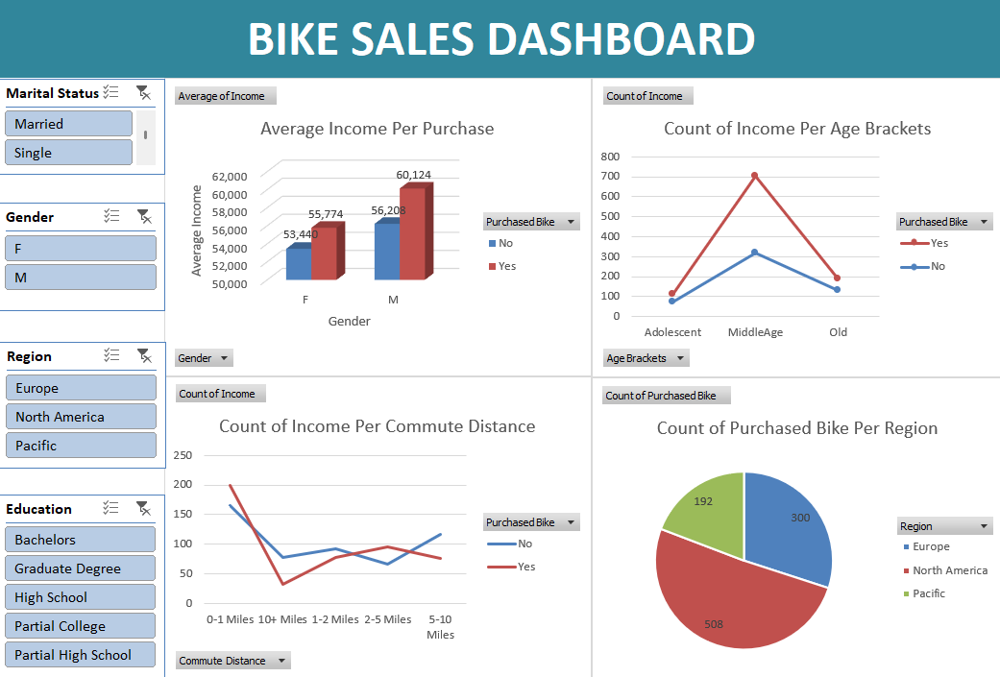

# Bike Sales Dashboard (Excel)

An interactive Excel dashboard analyzing bike purchase patterns using demographic and behavioral data.

## Dataset
Used the Alex The Analyst practice bike sales dataset.

## Dashboard Features
- **Average Income per Purchase** — chart comparing income levels against purchase decisions
- **Count of Income per Age** — distribution of income across age groups
- **Count of Income per Commute Distance** — relationship between commute distance and income
- **Count of Purchased Bike per Region** — regional breakdown of bike purchases
- **Interactive Slicers** — for dynamic filtering across all charts

## Tools Used
Microsoft Excel (PivotTables, PivotCharts, Slicers)

## Dashboard Preview

## Key Insight
[e.g. "Customers in the X region showed the highest bike purchase rate, correlating with shorter average commute distances."]

## Author
Vidapanakal Swetha  
[LinkedIn](https://linkedin.com/in/vidapanakal-swetha)
